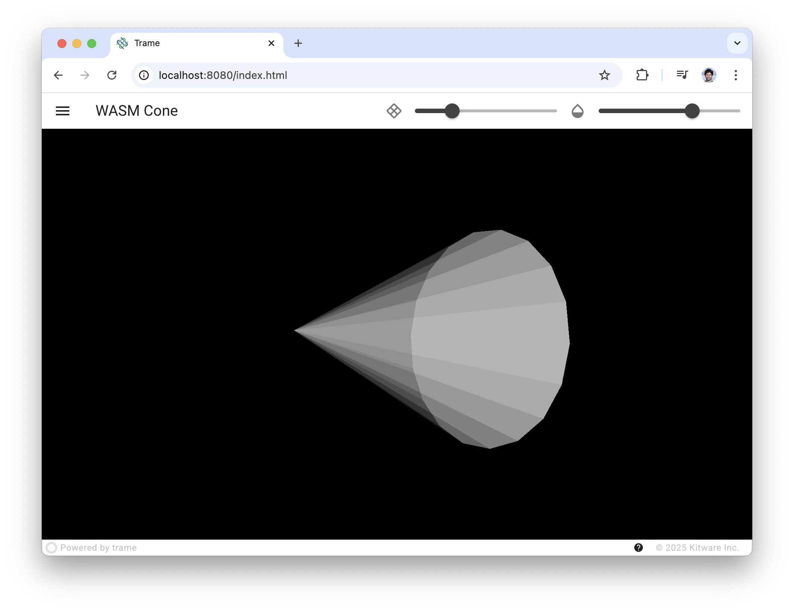

# Cone

This example aim to illustrate how to connect VTK.wasm to do local rendering with a VTK rendering pipeline and trame.
The code is purposfully simple to just illustrate the core usage of such setup.

## Content

The code show the creation of a VTK rendering pipeline where the object in the scene can be modified (mesh update) along with its representation (opacity update). 

As demonstrated, when modifying anything, you just need to call update on the widget that is getting used for exposing the 3D view on the client side.

We also connect the reset camera which internally get executed on the client side. 

Finally you can configure the maximum update rate you can have the server update the client with new geometry or rendering parameters. 

